# Тестування працездатності системи

**Тестування сервісу проводилося за допомогою Postman.**

## Запуск сервера

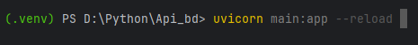

## GET /user

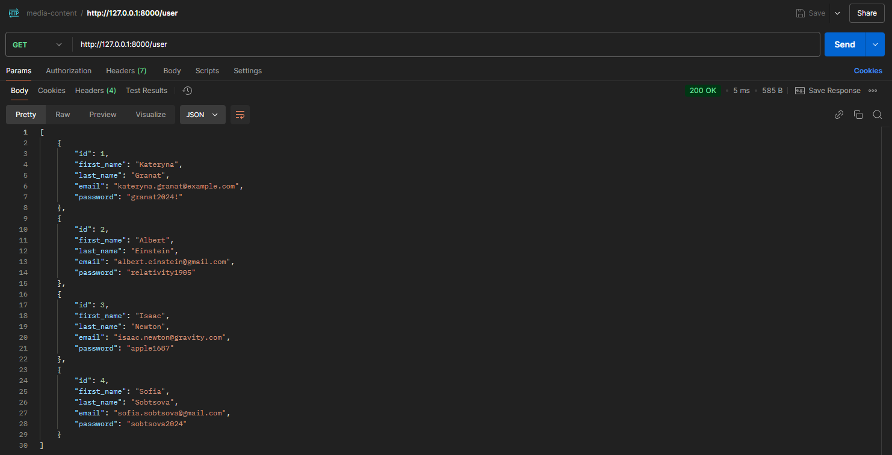

## GET /user/:id

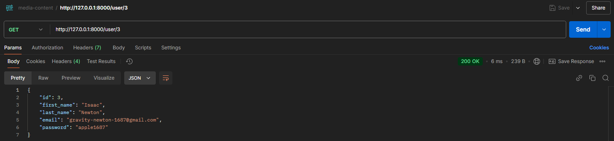

## POST /user

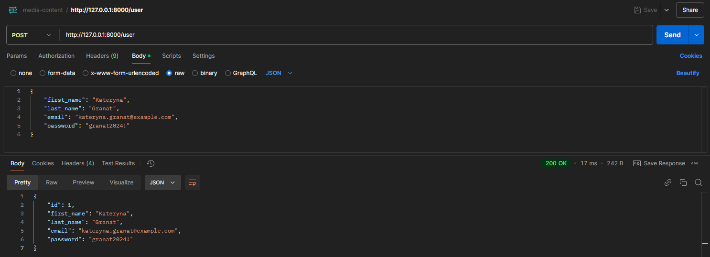

## PATCH /user/:id

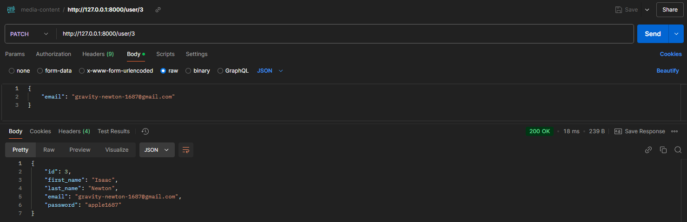

## DELETE /user/:id

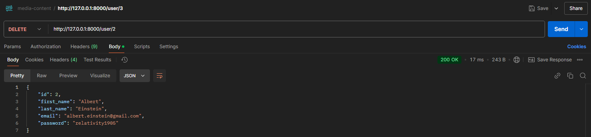

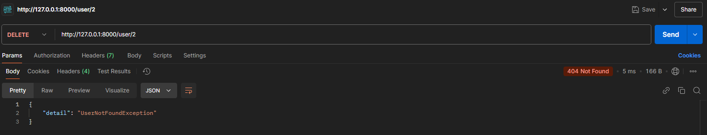

___

## GET /analysisreport

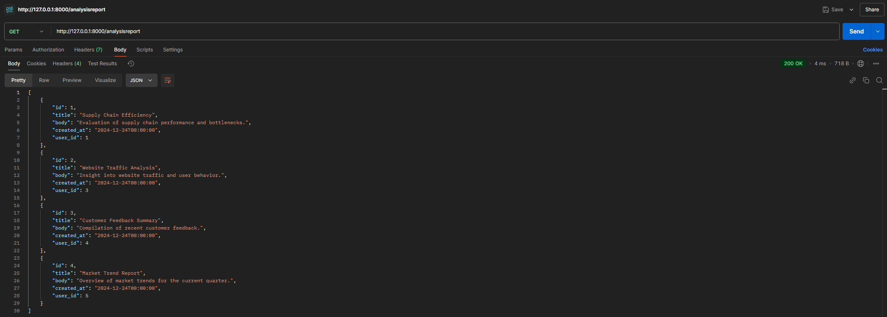

## GET /analysisreport/:id

## POST /analysisreport

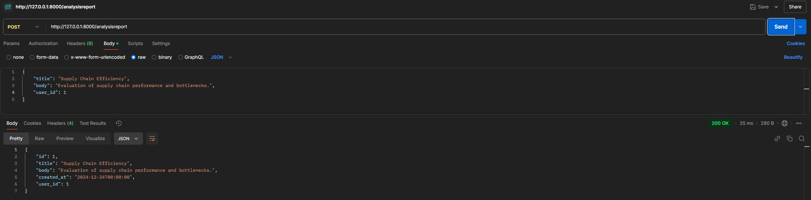

## PATCH /analysisreport/:id

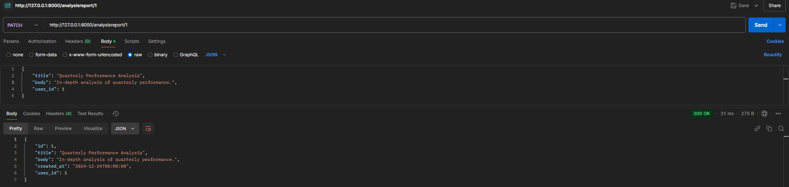

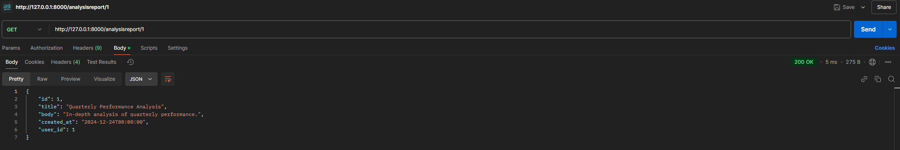

## DELETE /analysisreport/:id

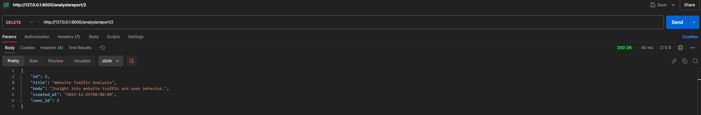

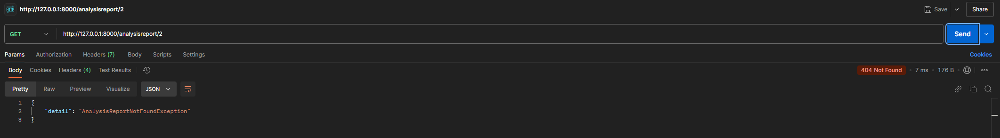

___

## EXCEPTION(User): DataMissingException

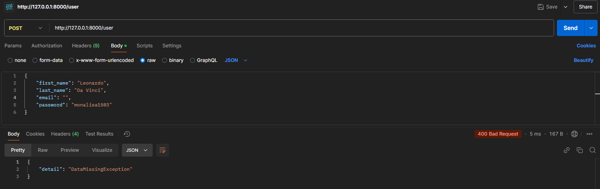

## EXCEPTION(User): EmailAlreadyExistsException

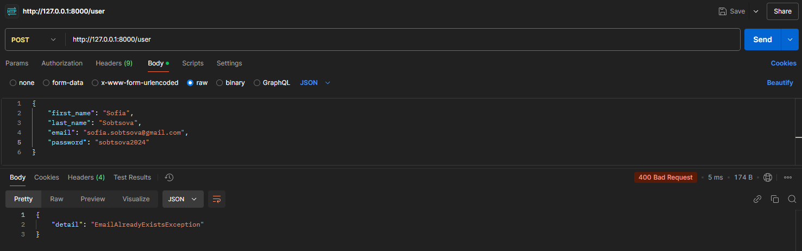

## EXCEPTION(User): UserNotFoundException

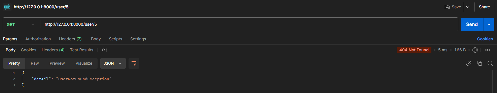

## EXCEPTION(AnalysisReport): UserNotFoundException

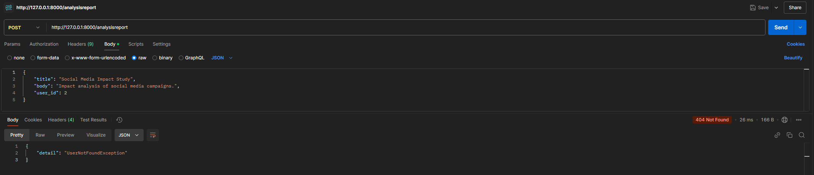

## EXCEPTION(AnalysisReport): ReportIdExistsException

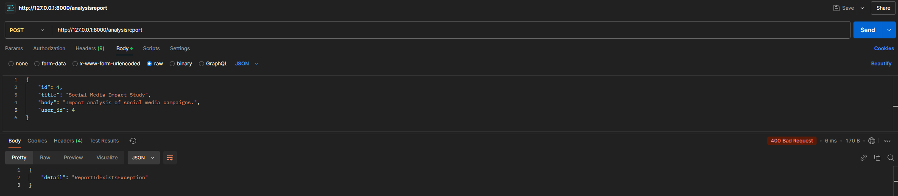

## EXCEPTION(AnalysisReport): AnalysisReportNotFoundException

